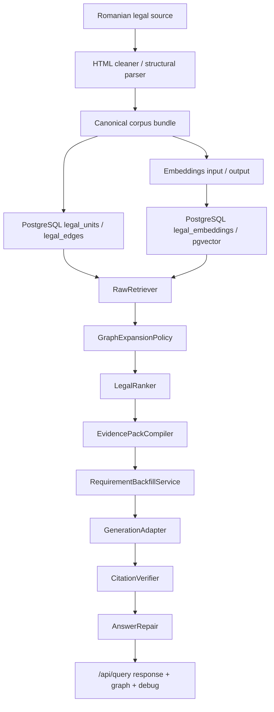
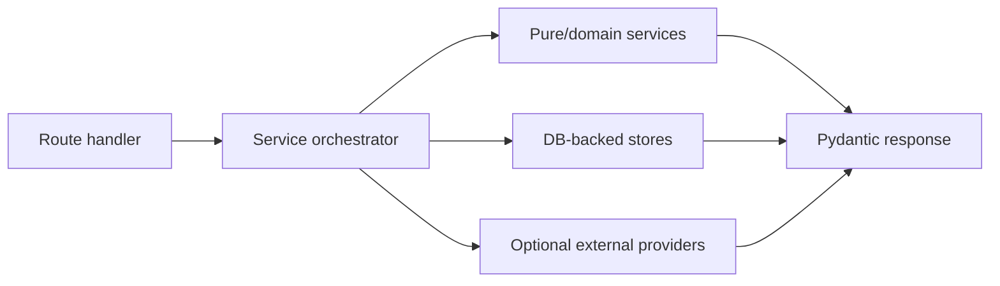

# Backend Architecture

LexAI backend is the server-side foundation for a Romanian legal operating system. It ingests legal sources, stores atomic legal truth, retrieves and ranks evidence, compiles an inspectable EvidencePack, generates grounded answers, verifies citations, and exposes graph/debug output for frontend Ask Mode and Explore Mode.

LexAI is not a generic legal chatbot. The legal source of truth is `LegalUnit.raw_text` in canonical bundles and `legal_units.raw_text` in PostgreSQL. Everything else is an aid: normalized text, retrieval text, chunks, embeddings, reranker scores, debug rows, and generated prose.

## Main Flow



## Repository Layers

| Layer | Paths | Responsibilities |
| --- | --- | --- |
| API app | `apps/api/app/main.py`, `apps/api/app/routes/` | FastAPI app factory, route registration, CORS, request entry points. |
| API schemas | `apps/api/app/schemas/` | Pydantic request/response contracts for query, retrieval, ranking, evidence, graph, and generation. |
| Query/RAG services | `apps/api/app/services/` | Query understanding, exact citation detection, retrieval orchestration, graph expansion, ranking, evidence, generation, verifier, repair. |
| DB runtime | `apps/api/app/db/` | SQLAlchemy async engine/session, ORM models, plain SQL migrations. |
| Ingestion | `ingestion/` | HTML scraping/cleaning, structural parsing, canonical export, chunks, reference candidates, manifests, validation. |
| Import and jobs | `scripts/`, `ingestion/imports.py`, `ingestion/import_repository.py` | CLI workflows for bundle planning, DB import, embeddings generation, evaluation, and smoke testing. |
| Contracts and docs | `contracts/`, `docs/` | JSON schemas and human-readable implementation docs. |
| Tests | `tests/`, `apps/api/app/tests/` | Unit, API, ingestion, regression, fixture, retrieval, ranker, and eval tests. |

## API App Composition

`apps/api/app/main.py` creates a FastAPI app titled `LexAI API`. It:

- configures CORS from `API_CORS_ORIGINS`;
- registers health, query, ingest, corpus, legal-units, admin, debug, and raw retrieval routes under `/api`;
- keeps a `/health` compatibility alias;
- disposes the async DB engine on shutdown.

Not every route module is product-complete. Some modules exist as placeholders or legacy surfaces, especially `corpus.py`, `domains.py`, `explore.py`, `search.py`, and several empty platform services.

## Runtime Request Boundaries



Route handlers are intentionally thin. The important behavior lives in services:

- `QueryOrchestrator` owns `/api/query`.
- `RawRetriever` owns `/api/retrieve/raw`.
- `PostgresRawRetrievalStore` owns DB retrieval queries.
- `PostgresImportRepository` owns DB import writes.
- `QueryResponseStore` keeps recent query responses in memory for `/api/query/{query_id}` and `/graph`.

Optional external providers must be timeout-bound and fallback-safe. Current optional provider integrations are:

- `LLMQueryDecomposer`, for retrieval-only query decomposition.
- `QueryEmbeddingService`, for Ollama query embeddings.
- OpenAI-compatible embedding provider in ingestion jobs.

## Core Data Contracts

`apps/api/app/schemas/query.py` is the central API contract module.

Important public response objects:

- `QueryResponse`: answer, citations, evidence units, verifier, graph, debug, warnings.
- `EvidenceUnit`: flat LegalUnit fields plus evidence metadata such as support role, MMR score, relevance, retrieval method, and score breakdown.
- `Citation`: evidence ID, legal unit ID, quote, label, source URL, and verification status.
- `VerifierStatus`: groundedness score, claim counts, claim results, checked citations, repair/refusal state.
- `GraphPayload`: graph nodes and graph edges for Ask/Explore surfaces.

Raw retrieval has its own contract in `apps/api/app/schemas/retrieval.py`:

- `RawRetrievalRequest`: question, filters, query frame, exact citations, optional query embedding, top-k, debug flag.
- `RetrievalCandidate`: unit ID, rank, retrieval score, score breakdown, matched terms, reason, optional LegalUnit dict.
- `RawRetrievalResponse`: candidates, methods, warnings, debug.

Ranking and graph expansion contracts live in `ranking.py` and `graph.py`.

## Source of Truth Boundaries

Legal truth:

- `LegalUnit.raw_text` in canonical bundles.
- `legal_units.raw_text` in PostgreSQL.

Retrieval aids:

- `normalized_text`
- `legal_chunks.retrieval_text`
- `embeddings_input.jsonl`
- `legal_embeddings.embedding`
- ranker score breakdowns
- optional query decomposition output

Never cite retrieval aids as law. Public citations and quote snippets must align to `raw_text`.

## Ingestion Boundary

The ingestion side is deterministic and file-based:

```text
source URL or fixture
-> scrape / clean HTML
-> parse structure
-> canonical LegalUnit records
-> contains LegalEdges
-> reference candidates
-> legal chunks
-> embeddings input
-> manifest + validation report
```

It does not decide legal conclusions and does not use an LLM. Reference candidates are not automatically promoted to graph edges unless they are resolved safely by later work.

## Database Boundary

Runtime persistence currently uses plain SQL migrations and two DB access styles:

- SQLAlchemy async sessions for API retrieval and health checks.
- `asyncpg` in `PostgresImportRepository` for import jobs.

Tables:

- `legal_units`: citable legal units and metadata.
- `legal_edges`: legal graph edges.
- `import_runs`: import audit records.
- `legal_embeddings`: pgvector vectors tied to legal units/chunks.

## Query/RAG Boundary

The RAG stack is designed to be inspectable:

- every fallback emits warnings/debug;
- every major stage can appear in `debug`;
- the generator drafts from EvidencePack, not from open-ended legal memory;
- verifier and repair gates decide whether an answer is publishable.

The demo labor-contract-modification flow expects article 41 paragraph 1 and paragraph 3 of Codul muncii to be retrieved, selected, cited, and verified.

## Current Implementation Status

Implemented and active:

- FastAPI route wiring.
- DB health and migration SQL.
- Canonical ingestion bundle pipeline.
- DB import planning and apply workflow.
- Query understanding and exact citation detection.
- Query frame registry for several Romanian legal intents.
- Internal DB raw retriever with exact citation, lexical/FTS, dense optional, intent lookup, RRF scoring.
- Optional query embedding service.
- Graph expansion policy with fallback.
- LegalRanker V1/V2 deterministic scoring.
- EvidencePack compiler with MMR and role classification.
- Requirement backfill for missing answer-required evidence.
- Deterministic generation adapter.
- Citation verifier.
- Answer repair/refusal.
- Query graph enrichment.
- Regression and fixture tests.

Partially implemented or not wired by default:

- DB graph-neighbor client for graph expansion.
- Qwen reranker through Ollama.
- Durable query-response persistence.
- Product-ready Explore/search/corpus routes.
- Alembic migrations.
- Broad corpus ingestion beyond demo bundles.

## Safety Invariants

1. The LLM is never the legal source of truth.
2. A legal claim must be supported by EvidencePack and citations.
3. Missing or weak evidence must produce warnings, repair, or refusal.
4. Raw legal text must not be semantically rewritten.
5. Encoding repair is allowed only for deterministic Romanian mojibake/diacritics repair.
6. Optional external services must not make the API fail when unavailable.
