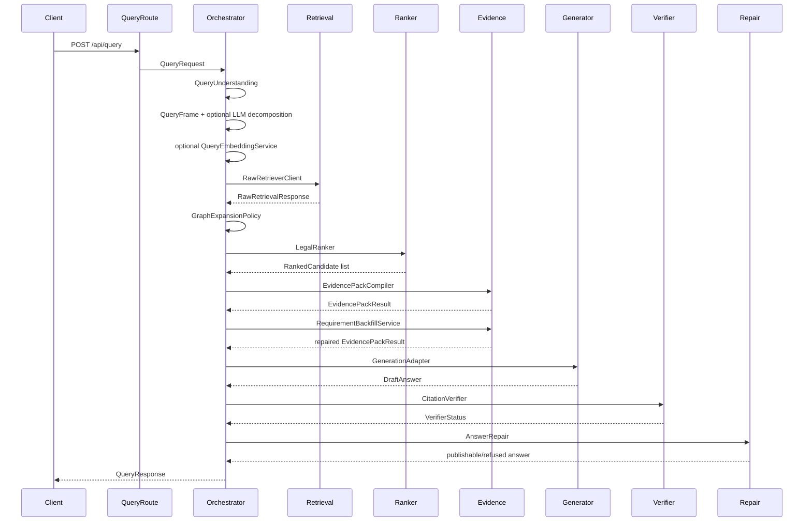

# RAG Pipeline

This document explains the full `/api/query` path implemented by `apps/api/app/services/query_orchestrator.py`.

The pipeline is deterministic-first and safety-gated. Its goal is not to let an LLM answer legal questions directly. Its goal is to retrieve citable LegalUnits, select an EvidencePack, draft an answer from that evidence, verify legal claims, and repair/refuse when support is weak.

## High-Level Sequence



## Stage 1: Query Understanding

Service: `QueryUnderstanding`

Responsibilities:

- normalize Romanian text;
- detect legal domain through `DomainRouter`;
- detect query types such as right, obligation, prohibition, sanction, procedure, definition, exception;
- detect temporal context;
- detect safety and ambiguity flags;
- extract exact citations through `ExactCitationDetector`;
- build retrieval filters;
- choose graph expansion policy.

Output: `QueryPlan`

Important rule: exact citations are lookup hints, not proof by themselves. They still need to resolve against `legal_units` and pass evidence/citation checks.

## Stage 2: Query Frame

Services:

- `QueryFrameBuilder`
- `LegalIntentRegistry`
- optional `LLMQueryDecomposer`

`QueryFrameBuilder` turns a question and QueryPlan into intent-level retrieval structure:

- domain;
- intents;
- meta intents;
- targets;
- actors;
- qualifiers;
- surface phrases;
- normalized terms;
- ambiguity status;
- confidence.

The registry currently includes labor-focused intents such as:

- `labor_contract_modification`
- `labor_salary_payment`
- `labor_dismissal`
- `labor_working_time`
- additional registry entries later in `query_frame.py`

`LLMQueryDecomposer` is optional. It is only allowed to enrich query decomposition for retrieval. It rejects forbidden output keys and unsafe text such as:

- answers;
- citations;
- unit IDs;
- article numbers;
- law IDs;
- source URLs;
- legal conclusions.

If the optional decomposer fails, the deterministic query frame remains authoritative.

## Stage 3: Optional Query Embedding

Service: `QueryEmbeddingService`

Environment:

```text
QUERY_EMBEDDING_ENABLED=false
OLLAMA_BASE_URL=http://127.0.0.1:11434
QUERY_EMBEDDING_MODEL=qwen3-embedding:4b
QUERY_EMBEDDING_TIMEOUT_SECONDS=20
```

When enabled, the service calls Ollama `/api/embed`, falling back to `/api/embeddings` for older Ollama-compatible behavior. It returns:

- embedding vector;
- model;
- dimension;
- availability;
- warnings;
- debug metadata.

Failures produce `query_embedding_unavailable` or `query_embedding_not_configured`. The query continues without dense retrieval.

## Stage 4: Raw Retrieval

Services:

- `RawRetrieverClient`
- `RawRetriever`
- `PostgresRawRetrievalStore`
- `EmptyRawRetrievalStore`

`RawRetrieverClient` builds `RawRetrievalRequest`. By default it uses the internal DB-backed retriever when `RAW_RETRIEVAL_BASE_URL` is empty. If a base URL is configured, it calls that external `/api/retrieve/raw`.

`RawRetriever` combines several candidate sources:

- exact citation lookup;
- PostgreSQL full-text search and lexical fallback;
- optional dense pgvector search when query embedding exists;
- intent governing rule lookup;
- parent context for governing rules.

RRF is calculated across method rankings and normalized into `[0, 1]`.

Raw retrieval score formula with dense available:

```text
S_raw =
0.30 * RRF
+ 0.25 * BM25
+ 0.20 * Dense
+ 0.10 * ExactCitation
+ 0.08 * DomainMatch
+ 0.04 * MetadataValidity
+ 0.03 * IntentPhraseMatch
```

Fallback formula without dense:

```text
S_raw =
0.40 * RRF
+ 0.35 * BM25
+ 0.10 * ExactCitation
+ 0.08 * DomainMatch
+ 0.04 * MetadataValidity
+ 0.03 * IntentPhraseMatch
```

If DB is unavailable, retrieval returns no candidates and explicit warnings instead of failing the whole API.

## Stage 5: Graph Expansion

Service: `GraphExpansionPolicy`

The policy takes raw retrieval candidates as seeds and can expand over neighbors with allowed edge types:

- `contains_parent`
- `contains_child`
- `references`
- `defines`
- `exception_to`
- `sanctions`
- `creates_obligation`
- `creates_right`
- `creates_prohibition`
- `procedure_step`

Current default app wiring does not inject a DB neighbors client. In that case, the policy falls back to seed candidates and seed graph nodes. This is expected and visible in debug.

## Stage 6: LegalRanker

Service: `LegalRanker`

The ranker merges raw retrieval candidates and graph-expanded candidates by `unit_id`.

There are two scoring paths:

- V1 linear score when no confident query frame exists.
- V2 query-frame-gated score when `QueryFrame.confidence >= 0.35`.

V1 features include:

- BM25 score;
- dense score;
- exact citation match;
- domain match;
- graph proximity;
- concept overlap;
- legal term overlap;
- temporal validity;
- source reliability;
- parent relevance;
- exception/definition/sanction indicators.

V2 adds query-frame features and gates:

- core issue score;
- target object score;
- actor score;
- qualifier score;
- retrieval score feature;
- structural fit;
- distractor penalty;
- target-without-core penalty;
- context-only penalty;
- gate floors/caps for exact citation, core issue, domain mismatch, distractors, irrelevant exceptions.

The ranker is still a signal layer, not legal truth.

## Stage 7: EvidencePack

Service: `EvidencePackCompiler`

The EvidencePack compiler:

- deduplicates ranked candidates;
- chooses candidate pool;
- classifies support role;
- selects diverse evidence using MMR;
- compacts labor-contract-modification evidence;
- builds graph nodes/edges;
- emits requirement coverage and selection debug.

Support roles:

- `direct_basis`
- `condition`
- `exception`
- `definition`
- `sanction`
- `procedure`
- `context`

Evidence final scoring includes MMR, required requirement coverage, same-article signals, role priority, generic context penalty, and distractor penalty.

## Stage 8: Requirement Backfill

Service: `RequirementBackfillService`

Backfill runs after the first EvidencePack and before generation. It looks for answer-required evidence missing from the selected pack, especially for known legal issue frames.

For the labor-contract-modification demo, answer-required evidence includes:

- agreement rule;
- contract modification salary scope.

Backfill uses the real ranked/expanded candidate pool. It must not invent unit IDs or legal text.

## Stage 9: Generation

Service: `GenerationAdapter`

Generation is deterministic/template/extractive in the current repo state. It selects focused evidence, drafts answer text, creates draft citations, and emits generation warnings.

The labor-contract-modification path focuses on:

- contract modification basis;
- salary scope;
- salary element where useful;
- excluding generic salary distractors.

If evidence is insufficient, the adapter returns a refusal-style draft:

```text
Nu pot formula un raspuns juridic sustinut pe baza corpusului disponibil.
```

## Stage 10: Citation Verification

Service: `CitationVerifier`

The verifier:

- checks citation unit IDs exist in EvidencePack;
- checks citation snippets align to `raw_text`;
- extracts legal claims from answer text;
- scores claim support against evidence units;
- marks each claim as strongly supported, supported, weakly supported, unsupported, or not checked;
- computes groundedness and pass/fail.

Support is based on lexical overlap, concept overlap, lexical-semantic fallback, and citation confidence. The verifier is deterministic V1 and intentionally conservative.

## Stage 11: Answer Repair

Service: `AnswerRepair`

Repair is the final safety gate:

- removes invalid citations;
- refuses when there is no evidence;
- refuses when there are no verifiable legal claims;
- refuses when legal claims are unsupported;
- removes unsupported claims when some supported claims remain;
- tempers answers with weak support.

The final `QueryResponse.answer`, `citations`, `verifier`, and `warnings` are the repaired versions.

## Stage 12: Graph Enrichment

Service: `QueryGraphEnricher`

The graph enricher adds:

- query node;
- answer node;
- cited legal-unit nodes;
- cited claim nodes;
- `retrieved_for_query`, `cited_in_answer`, and `supports_claim` edges;
- highlighted node/edge IDs;
- reasoning path summary.

This graph is returned in `/api/query` and can be retrieved separately through `/api/query/{query_id}/graph`.

## Demo Path Expectations

Demo question:

```text
Poate angajatorul sa-mi scada salariul fara act aditional?
```

Required legal units:

- `ro.codul_muncii.art_41.alin_1`
- `ro.codul_muncii.art_41.alin_3`

Expected behavior:

- cite article 41 paragraph 1;
- cite article 41 paragraph 3;
- avoid generic salary distractors;
- keep `raw_text` as citation source;
- expose retrieval/ranking/evidence/verifier details in debug.

## Failure Behavior

Every non-critical unavailable subsystem should degrade safely:

- no DB -> empty retrieval with warnings;
- no query embedding -> lexical/exact retrieval continues;
- no graph neighbors -> seed-only graph fallback;
- no evidence -> refusal;
- unsupported claims -> repair or refusal;
- invalid citations -> removed.

The system should fail closed for legal claims, not fabricate legal answers.
